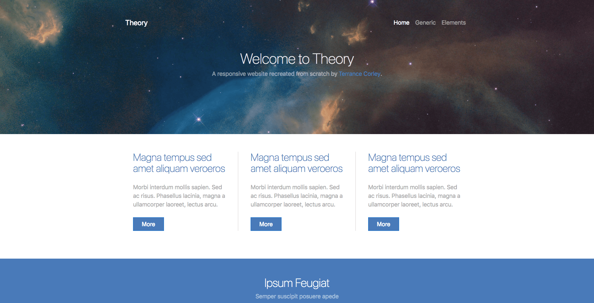

# Theory

**Live App** : [https://terrancecorley.com/theory](https://terrancecorley.com/theory)

## Summary  

Theory is a static mock website I created for client-side learning purposes. It features an elegant, modern design and can serve as a template for many client solutions.  

## Screenshots

### Site Image

## Tech Stack  

Theory was created with the following technologies:

**Client**: Bootstrap, CSS3, HTML5

**Deployment**: GitHub Pages
